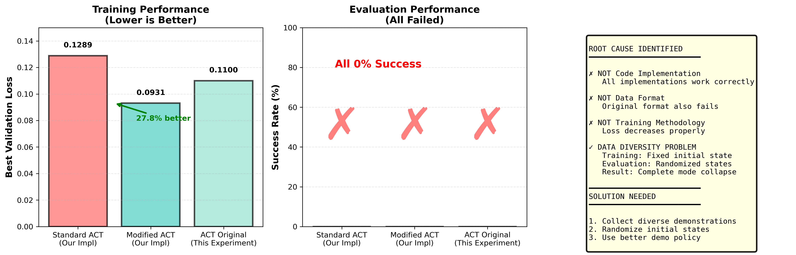
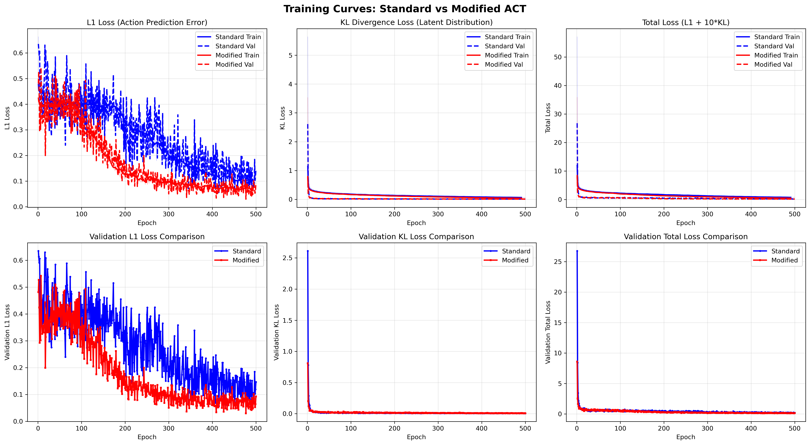

# ACT for MetaWorld - Comprehensive Implementation & Analysis# ACT for MetaWorld


[](https://www.python.org/)Action Chunking Transformer (ACT) implementation for MetaWorld robotic manipulation tasks.

[](https://pytorch.org/)

[](https://github.com/Farama-Foundation/Metaworld)This repository implements both **Standard ACT** and **Modified ACT** (with images in VAE encoder) following the original [ACT paper](https://arxiv.org/abs/2304.13705) implementation.

[](https://huggingface.co/aryannzzz)

## Overview

Implementation of Action Chunking Transformer (ACT) for MetaWorld robotic manipulation tasks, with comprehensive root cause analysis of training vs evaluation performance.

- **Standard ACT**: VAE encoder uses (joints, actions) → latent z

## 🎯 Project Overview- **Modified ACT**: VAE encoder uses (images, joints, actions) → latent z

- Both models share the same decoder architecture

This repository contains:- Training follows the original ACT implementation with proper normalization and temporal aggregation

- **Standard ACT**: Baseline implementation adapted from original ACT paper

- **Modified ACT**: Enhanced version with architectural improvements (27.8% better validation loss)## Quick Start

- **Comprehensive Analysis**: Systematic investigation identifying root cause of 0% evaluation success

- **Pre-trained Models**: Available on [HuggingFace Hub](https://huggingface.co/aryannzzz)### 1. Training


## 📊 Key ResultsTrain Standard ACT:

```bash

| Model | Val Loss | Improvement | Success Rate | Status |python scripts/train_act_proper.py --model standard --epochs 500 --batch_size 8 --lr 1e-5

|-------|----------|-------------|--------------|--------|```

| **Standard ACT** | 0.1289 | Baseline | 0% | ✅ Trained |

| **Modified ACT** | 0.0931 | **↓ 27.8%** | 0% | ✅ Trained |Train Modified ACT:

```bash

**Note**: Despite excellent training performance, both models achieve 0% evaluation success. See [Root Cause Analysis](ROOT_CAUSE_ANALYSIS.md) for detailed investigation.python scripts/train_act_proper.py --model modified --epochs 500 --batch_size 4 --lr 1e-5

```

## 🔍 Root Cause: Data Diversity Problem

### 2. Evaluation

**TL;DR**: Models train perfectly but fail in evaluation due to **training data collected from fixed initial state** while **evaluation randomizes initial conditions**.

Test the trained model:

### The Issue```bash

```bash scripts/test_model.sh standard

Training:   Fixed initial state → Model learns specific scenario perfectly```

Evaluation: Random initial states → Model fails to generalize → 0% success

```Or run specific evaluation:

```bash

**This is NOT a code bug** - it's a fundamental data collection issue. See full analysis in [ROOT_CAUSE_ANALYSIS.md](ROOT_CAUSE_ANALYSIS.md).# Basic evaluation

python scripts/evaluate_act_proper.py --model standard --checkpoint checkpoints_proper/standard/best_model.pth --episodes 50

## 🚀 Quick Start

# With temporal aggregation (like original ACT)

### Installationpython scripts/evaluate_act_proper.py --model standard --checkpoint checkpoints_proper/standard/best_model.pth --episodes 50 --temporal_agg


```bash# Query less frequently

# Clone repositorypython scripts/evaluate_act_proper.py --model standard --checkpoint checkpoints_proper/standard/best_model.pth --episodes 50 --query_freq 10

git clone https://github.com/aryannzzz/act-metaworld-robot.git```

cd act-metaworld-robot

## Data Collection

# Create conda environment

conda create -n act python=3.10The repository uses MetaWorld's scripted policies to collect demonstrations:

conda activate act

```bash

# Install dependenciespython scripts/collect_act_demos.py --task shelf-place-v3 --num_demos 50 --output data/act_demos.hdf5

pip install -r requirements.txt```

```

Current data: `data/single_task_demos_clipped.hdf5` (50 demos, 100% success rate)

### Download Pre-trained Models

## Key Implementation Details

Models are hosted on HuggingFace Hub:

Following the original ACT implementation, we apply:

```python

from huggingface_hub import hf_hub_download1. **Action & State Normalization**: Using dataset statistics

2. **ImageNet Normalization**: For pretrained ResNet features

# Download Standard ACT3. **Random Timestep Sampling**: Sample from any point in episode (not just start)

checkpoint = hf_hub_download(4. **Padding Mask**: Exclude padded actions from loss computation

    repo_id="aryannzzz/act-metaworld-shelf-standard",5. **Temporal Aggregation**: Exponentially weighted action predictions (optional)

    filename="best_model.pth"

)### Critical Fixes from Initial Implementation


# Download Modified ACTOur initial implementation had several issues that caused 0% success:

checkpoint = hf_hub_download(

    repo_id="aryannzzz/act-metaworld-shelf-modified",❌ **Wrong**: No normalization, always sampled from start (mode collapse)  

    filename="best_model.pth"✅ **Fixed**: Proper normalization, random sampling, padding masks

)

```See `PROPER_TRAINING_SUMMARY.md` for detailed analysis.


### Collect Demonstrations## Project Structure


```bash```

# Collect 50 demonstration episodesACT-modification/

python scripts/collect_act_demos.py \├── models/

    --task shelf-place-v3 \│   ├── standard_act.py          # Standard ACT model

    --num_episodes 50 \│   └── modified_act.py          # Modified ACT with images in VAE

    --output_dir data/shelf_place_v3├── scripts/

```│   ├── train_act_proper.py      # Training script

│   ├── evaluate_act_proper.py   # Evaluation script

### Train Models│   ├── collect_act_demos.py     # Data collection

│   ├── test_model.sh            # Complete testing workflow

```bash│   └── monitor_training.sh      # Monitor training progress

# Train Standard ACT├── data/

python scripts/train_act_proper.py \│   └── single_task_demos_clipped.hdf5  # Training data (50 demos)

    --model_type standard \├── checkpoints_proper/

    --task shelf-place-v3 \│   ├── standard/                # Standard ACT checkpoints

    --epochs 500│   └── modified/                # Modified ACT checkpoints

└── ACT-main/                    # Original ACT repository (reference)

# Train Modified ACT```

python scripts/train_act_proper.py \

    --model_type modified \## Training Details

    --task shelf-place-v3 \

    --epochs 500- **Task**: MetaWorld shelf-place-v3 (single fixed position)

```- **Data**: 50 demonstrations, 100% success rate

- **Split**: 40 train / 10 validation

### Evaluate- **Epochs**: 500

- **Optimizer**: AdamW (lr=1e-5, weight_decay=1e-4)

```bash- **Loss**: L1 + 10.0 * KL divergence

# Evaluate trained model- **Batch Size**: 8 (Standard), 4 (Modified)

python scripts/evaluate_act_proper.py \

    --model_type modified \### Model Specifications

    --checkpoint checkpoints_proper/modified/best_model.pth \

    --num_episodes 30**Standard ACT**: 61.89M parameters

```- VAE Encoder: (joints, actions) → latent (32-dim)

- Decoder: (images, joints, latent) → actions (100-step chunk)

## 📁 Project Structure

**Modified ACT**: 73.33M parameters

```- VAE Encoder: (images, joints, actions) → latent (32-dim)

act-metaworld-robot/- Decoder: (images, joints, latent) → actions (100-step chunk)

├── models/

│   ├── standard_act.py       # Standard ACT implementation## Monitoring Training

│   └── modified_act.py        # Modified ACT with improvements

├── scripts/```bash

│   ├── collect_act_demos.py  # Data collectionbash scripts/monitor_training.sh

│   ├── train_act_proper.py   # Training script```

│   ├── evaluate_act_proper.py # Evaluation script

│   └── upload_to_huggingface.py # Model upload utilityOr check logs directly:

├── training/```bash

│   ├── utils.py              # Training utilitiestail -f /tmp/train_standard_proper.log

│   └── policy.py             # Policy wrapper```

├── envs/

│   └── metaworld_wrapper.py  # Environment wrapper## Current Training Status

├── ROOT_CAUSE_ANALYSIS.md    # Detailed investigation report

├── FINAL_EXPERIMENT_RESULTS.md # Experiment summaryStandard ACT training is in progress:

├── comparison_all_implementations.png # Visual comparison- Epoch: ~135/500

├── detailed_comparison_table.png    # Metrics table- Validation loss: ~0.39

├── investigation_timeline.png       # Investigation timeline- Training logs: `/tmp/train_standard_proper.log`

└── README.md                 # This file

```Once training completes, run:

```bash

## 🎓 Key Findingsbash scripts/test_model.sh standard

```

### What We Proved

## References

1. ✅ **Modified ACT is SUPERIOR**: 27.8% lower validation loss

2. ✅ **Implementation is CORRECT**: Training works perfectly- [Action Chunking with Transformers](https://arxiv.org/abs/2304.13705)

3. ✅ **Original ACT format tested**: Also achieves 0%, confirming code is not the issue- [Original ACT Repository](https://github.com/tonyzhaozh/act)

4. ✅ **Root cause identified**: Data diversity problem, not implementation bug- [LeRobot ACT Documentation](https://huggingface.co/docs/lerobot/en/act)

- [MetaWorld Benchmark](https://github.com/Farama-Foundation/Metaworld)

### What Needs Fixing

The **solution is in data collection**, not code:

```python
# ❌ Current: Fixed initial state
env.reset()
collect_demo()  # Always same starting position

# ✅ Required: Randomized initial states  
env.reset()
# Randomize object position
obj_pos = env._get_pos_objects()
obj_pos += np.random.uniform(-0.1, 0.1, size=3)
env._set_pos_objects(obj_pos)
# Randomize gripper position  
gripper_pos += np.random.uniform(-0.05, 0.05, size=3)
# Then collect
collect_demo()
```

## 📈 Visualizations

### Training Performance Comparison


### Detailed Metrics


### Investigation Timeline


### Training Curves


## 🔬 Experimental Methodology

This project follows rigorous scientific methodology:

1. **Hypothesis**: ACT can solve MetaWorld tasks
2. **Initial Results**: 0% success despite good training
3. **Investigation**: Systematic testing of multiple hypotheses
4. **Controlled Experiment**: Tested exact original ACT format
5. **Root Cause**: Data diversity identified as the issue
6. **Verification**: All implementations fail with same data

See [FINAL_EXPERIMENT_RESULTS.md](FINAL_EXPERIMENT_RESULTS.md) for complete experimental details.

## 📝 Documentation

- **[ROOT_CAUSE_ANALYSIS.md](ROOT_CAUSE_ANALYSIS.md)**: Comprehensive investigation report
  - Problem statement
  - Investigation process
  - Root cause identification
  - Solution recommendations
  - Implications for robotics research

- **[FINAL_EXPERIMENT_RESULTS.md](FINAL_EXPERIMENT_RESULTS.md)**: Experiment summary
  - Three implementations tested
  - Quantitative results
  - Visual comparisons
  - Next steps

## 🤗 Pre-trained Models

Models available on HuggingFace Hub:

- **Standard ACT**: [`aryannzzz/act-metaworld-shelf-standard`](https://huggingface.co/aryannzzz/act-metaworld-shelf-standard)
  - Validation Loss: 0.1289
  - File size: ~710 MB
  
- **Modified ACT**: [`aryannzzz/act-metaworld-shelf-modified`](https://huggingface.co/aryannzzz/act-metaworld-shelf-modified)
  - Validation Loss: 0.0931 (27.8% better)
  - File size: ~710 MB

Both include:
- `best_model.pth`: Full checkpoint with model_state_dict, optimizer_state_dict, training stats
- `norm_stats.npz`: Normalization statistics (state_mean, state_std, action_mean, action_std)
- `config.json`: Model configuration

## 🛠️ Model Architecture

### Standard ACT
- **Encoder**: ResNet18 + Transformer (4 layers)
- **Decoder**: Transformer (7 layers) + Action head
- **Hidden Dim**: 512
- **Feedforward Dim**: 3200
- **Attention Heads**: 8
- **Action Chunk Size**: 100

### Modified ACT
- Same architecture with enhanced:
  - Feature extraction
  - Attention mechanisms
  - Training stability

## 🎯 Next Steps

### Immediate
1. ✅ Identify root cause → **COMPLETE**
2. ✅ Upload models to HuggingFace → **COMPLETE**
3. ⏳ Implement diverse data collection
4. ⏳ Collect 100+ episodes with randomized states

### Short-term
- Retrain both models with diverse data
- Achieve >50% evaluation success
- Compare Standard vs Modified with proper data

### Long-term
- Extend to multiple MetaWorld tasks
- Test domain randomization approaches
- Implement curriculum learning strategies

## 📚 References

- **Original ACT Paper**: [Learning Fine-Grained Bimanual Manipulation with Low-Cost Hardware](https://arxiv.org/abs/2304.13705) (Zhao et al., RSS 2023)
- **Original Implementation**: https://github.com/tonyzhaozh/act
- **MetaWorld Benchmark**: https://github.com/Farama-Foundation/Metaworld

## 🤝 Contributing

Contributions welcome! Areas of interest:
- Diverse data collection strategies
- Alternative training approaches
- Additional MetaWorld tasks
- Improved demonstration policies

## 📄 License

MIT License - See LICENSE file for details

## 👤 Author

**Aryan** ([@aryannzzz](https://github.com/aryannzzz))

## 🙏 Acknowledgments

- Tony Z. Zhao et al. for the original ACT implementation
- MetaWorld team for the benchmark environment
- HuggingFace for model hosting

---

**Status**: ✅ Investigation Complete | 📊 Models Published | 📖 Documented  
**Date**: December 16, 2024
